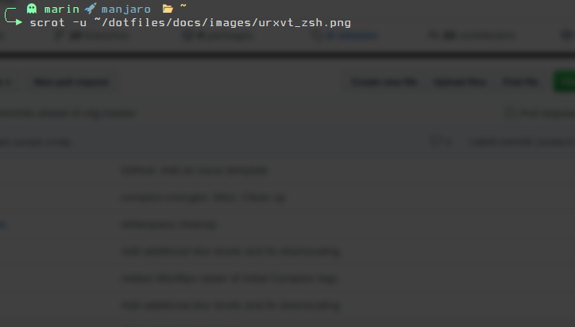
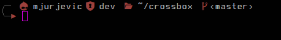
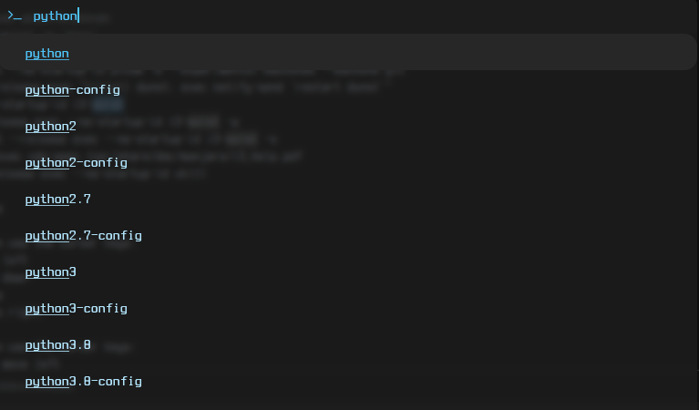
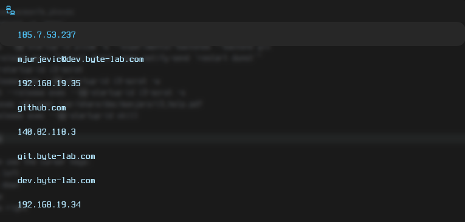
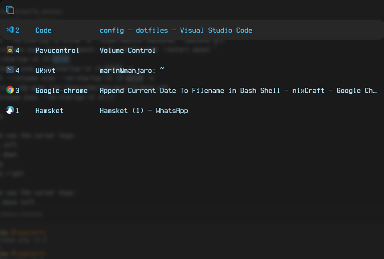

# dotfiles

- [i3](https://github.com/i3/i3)
- [polybar](https://github.com/polybar/polybar)
- [rxvt-unicode](http://software.schmorp.de/pkg/rxvt-unicode.html)
- [oh-my-zsh](https://github.com/ohmyzsh/ohmyzsh)
- [rofi](https://github.com/davatorium/rofi)
- [vscode](https://code.visualstudio.com/)
- [cava](https://github.com/karlstav/cava)
- [picom](https://github.com/yshui/picom)
- [autorandr](https://github.com/phillipberndt/autorandr)
- [dotgit](https://github.com/kobus-v-schoor/dotgit)
- [nerd-fonts](https://github.com/ryanoasis/nerd-fonts)
- and other less important stuff


*If you're not using dotgit, make sure to setup that first. It will save you going through this process again ;)*

All applications listed here are mostly mainstream and google is full of documentation how to start. I spent a lot of time customizing settings exactly the way I want them. In average, I would say it took me 10% time to get things running and 90% time getting things to run the way I want them to run. Instead of going through default settings, I will highlight some tweaks I did so you get a feeling how to do customize modules the way you want to.


## i3
[config](dotfiles/common/.i3/config)
```
# remove titlebar from windows
for_window [class="^.*"] border pixel 1

# enable floating mode
for_window [class="nrfconnect"] floating enable

# map workspaces on monitors
workspace $ws1 output eDP1
workspace $ws2 output eDP1

# map workspace on multiple monitors (useful with autorandr)
workspace $ws3 output DP2-1 HDMI1

# Autostart 
exec --no-startup-id "sleep 2; nice -n 10 hamsket"

# Configure keyboard layouts - Alt + Shift Toggle
exec --no-startup-id setxkbmap -model pc104 -layout us,hr -option grp:alt_shift_toggle

# disable beeps
exec --no-startup-id xset b off

# launch polybar (in my i3 I commented out this because of autorandr hook)
#exec_always --no-startup-id "sleep 2; $HOME/.config/polybar/launch.sh"

# launch hotkeys
bindsym $mod+F2 exec google-chrome-stable

# start rofi - there are more modes - check docs
bindsym $mod+d exec --no-startup-id rofi -show run 
bindsym Mod1+Tab exec --no-startup-id rofi -show window
bindsym $mod+s exec --no-startup-id rofi -show ssh

# start picom with experimental features (needed for blur) and glx backend
exec --no-startup-id "sleep 2; nitrogen --restore; sleep 1; picom -b --experimental-backends --backend glx"

# Lock screen
bindsym $mod+9 exec --no-startup-id blurlock

# toggle all polybars visibility - they must have ipc enabled
bindsym $mod+F11 exec polybar-msg cmd toggle

## override move/focus with vim commands (shifted to left by default)
bindsym $mod+h focus left
bindsym $mod+j focus down
bindsym $mod+k focus up
bindsym $mod+l focus right

# move focused window
bindsym $mod+Shift+h move left
bindsym $mod+Shift+j move down
bindsym $mod+Shift+k move up
bindsym $mod+Shift+l move right

# Open applications on specific workspaces 

assign [class="Hamsket"] $ws1
assign [class="Google-chrome"] $ws3
assign [class="Pcmanfm"] $ws2
```
*To find out window class use `xprop`*

*Keep in mind pop-ups and all new instances of same class will end up on assigned workspace instead of the workspace where current window class instance is opened*

## polybar

TODO

## rxvt-unicode
[.Xresources](dotfiles/common/.Xresources)

*I did not have success with this terminal in debian in combination with nerd fonts*

Terminess fonts, which I primarily use, are double (sometimes ~triple) wider than standard fonts. rxvt-unicode does not support these fonts out of the box. To make it work, you need to install [wcwidth-icons](https://github.com/powerman/wcwidth-icons). After installing, add `export LD_PRELOAD=/usr/lib/libwcwidth-icons.so` to your .profile. 

```
# set font and icon file for rofi
URxvt.font:                       xft:TerminessTTFNerdFont:size=12:style=Bold
URxvt*iconFile:                   /usr/share/icons/Papirus/64x64/apps/terminal.svg

# use fork-here extension - opens new terminal with $PWD set to original one
URxvt.keysym.Shift-Control-Return: perl:fork-here:fork-at-cwd
URxvt.perl-ext:                     fork-here

# adjust this if letters are too close to each other
URxvt*letterSpace:                  1 

# change cursor color
URxvt*cursorColor:                  #f200ff
```

## oh-my-zsh
[.zshrc](dotfiles/common/.zshrc)

[gnzsh.zsh-theme](dotfiles/common/.oh-my-zsh/custom/themes/gnzh.zsh-theme)


```
# custom
ZSH_THEME="gnzh"

# last three in custom dir
plugins=(
  archlinux
  autojump
  docker
  git
  zsh-autosuggestions
  zsh-completions
  zsh-docker-aliases
)

# sourcing custom aliases from home dir
source $HOME/.aliases

# walk through completion choices with vim keys
bindkey -M menuselect 'h' vi-backward-char
bindkey -M menuselect 'k' vi-up-line-or-history
bindkey -M menuselect 'l' vi-forward-char
bindkey -M menuselect 'j' vi-down-line-or-history
```

Theme is located in .oh-my-zsh/custom/themes folder. When you select theme, zsh will override it with custom implementation if it finds there.
All colors are pulled out to variables so refer to `print_term_colors` or 256-bit color map if you don't have it.




SSH version



## rofi
[config](dotfiles/common/.config/rofi/config.rasi)

All default, except [material](dotfiles/common/.config/rofi/material.rasi) theme.
There's also [my_theme.rasi](dotfiles/common/.config/rofi/my_theme.rasi) which I don't use anymore...

Rofi comes with different modis, here three main ones are used. 
  - `run` - launch applications
  
  

  - `ssh` - start ssh session

  

  - `window` - switch running applications (your usual Alt-Tab solution)

  


You can setup icons and font in configuration selector
```
configuration {
  show-icons: true;
  font: "TerminessTTFNerdFont Bold 12";
  drun-display-format: "{icon} {name}";
  display-run: " ";
  display-ssh: " ";
  display-window: " ";
  modi: "window,run,ssh";
}
```

To learn more about layout, check [man](http://manpages.ubuntu.com/manpages/bionic/man5/rofi-theme.5.html) pages.

## VSCode

You can check [keybindings.json](dotfiles/common/.config/Code/User/keybindings.json) for escaping some character sequences in terminal (e.g. Ctrl + N for next command). 
Most of the settings.json entries are related to extensions. Here's few on top that are setting up theme, icons, font and integrated terminal settings.
```
"terminal.integrated.commandsToSkipShell": [
        // Ensure the toggle sidebar visibility keybinding skips the shell
        "workbench.action.toggleSidebarVisibility",
        // Send quick open's keybinding to the shell
        "-workbench.action.quickOpen",
    ],
	
    "workbench.colorTheme": "Taurus",
    "liveServer.settings.donotShowInfoMsg": true,

    "terminal.external.linuxExec": "urxvt",
    "terminal.integrated.fontFamily": "TerminessTTF Nerd Font",
    "terminal.integrated.scrollback": 100000,

    "workbench.colorCustomizations": {
      "terminal.ansiBlack": "#000000",
		  ...
		  "terminalCursor.background": "#f200ff",
		  "terminalCursor.foreground": "#f200ff",
    },

    "editor.fontLigatures": true,
    "editor.fontFamily": "TerminessTTF Nerd Font",
    "editor.fontWeight": "bold",
```
I still use same [settings.json](dotfiles/common/.config/Code/User/settings.json) for multiple machines which is not good...


## cava
[config](dotfiles/common/.config/cava/config)

Console-based Audio Visualizer for Alsa. Not much to say here, except make sure to turn on method = ncurses for gradient option.
```
gradient = 1
gradient_count = 4
gradient_color_1 = '#66FF66'
gradient_color_2 = '#CCFF66'
gradient_color_3 = '#FFCC00'
gradient_color_4 = '#FF3300'
```


## picom
[config](dotfiles/common/.config/picom/picom.conf)

Picom is a modern compton fork - compositor for X11. It supports blur, but it must be run with experimental/glx flags.
```
blur-background = true;
# Blur background of opaque windows with transparent frames as well.
blur-background-frame = true;
# Do not let blur radius adjust based on window opacity.
blur-background-fixed = true;
blur:
{
    method = "gaussian";
    size = 8;
    deviation = 3.5;
};
```

Also, if you're using round borders in rofi you have to exclude rofi from drawing shadows
```
shadow-exclude = [
    "! name~=''",
    ...
    "name *= 'rofi'"
}
```

## autorandr
autorandr automatically select a display configuration based on connected devices. It's a must have when using laptop. So my idea was to keep three separate hooks depending on which configuration is loaded. Two things that change between these configurations are i3 workspaces and polybars. i3 is handled in config by specifying mulitple monitors for single workspace.
For polybar, I just launch different set of polybars depending on which hook is triggered.

  - [mobile](dotfiles/laptop/.config/autorandr/mobile/postswitch) - when laptop is undocked. In this configuration default polybars are launched.
  - [workstation](dotfiles/laptop/.config/autorandr/workstation/postswitch) - when laptop is docked on work (2 monitors) polybars from config_workstation are launched
  - [home](dotfiles/laptop/.config/autorandr/home/postswitch) - when laptop is home it's connected to monitor over HDMI and config_home polybars are launched

### Useful links:
- [256-bit color map](https://upload.wikimedia.org/wikipedia/commons/1/15/Xterm_256color_chart.svg)
- [Character map browser](http://mathew-kurian.github.io/CharacterMap/)
