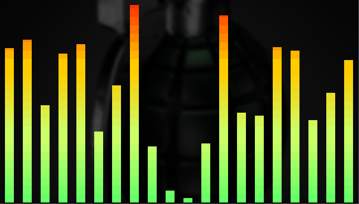

# dotfiles v1 (2020)

- [i3](https://github.com/i3/i3)
- [polybar](https://github.com/polybar/polybar)
- [rxvt-unicode](http://software.schmorp.de/pkg/rxvt-unicode.html)
- [oh-my-zsh](https://github.com/ohmyzsh/ohmyzsh)
- [rofi](https://github.com/davatorium/rofi)
- [vscode](https://code.visualstudio.com/)
- [cava](https://github.com/karlstav/cava)
- [picom](https://github.com/yshui/picom)
- [autorandr](https://github.com/phillipberndt/autorandr)
- [dotgit](https://github.com/kobus-v-schoor/dotgit)
- [nerd-fonts](https://github.com/ryanoasis/nerd-fonts)
- and other less important stuff


*If you're not using dotgit, make sure to setup that first. It will save you going through this process again ;)*

All applications listed here are mostly mainstream and google is full of documentation how to start. I spent a lot of time customizing settings exactly the way I want them. On average, I would say it took me 10% time to get things running and 90% time getting things to run the way I want them to run. Instead of going through default settings, I will highlight some tweaks I did so you get a feeling how to customize modules.


## i3

[pc046 config](dotfiles/plain/pc046/.i3/config)
```bash
# remove titlebar from windows
for_window [class="^.*"] border pixel 1

# enable floating mode
for_window [class="nrfconnect"] floating enable

# map workspaces on monitors
workspace $ws1 output eDP1
workspace $ws2 output eDP1

# map workspace on multiple monitors (useful with autorandr)
workspace $ws3 output DP2-1 HDMI1

# Autostart 
exec --no-startup-id "sleep 2; nice -n 10 hamsket"

# Configure keyboard layouts - Alt + Shift Toggle
exec --no-startup-id setxkbmap -model pc104 -layout us,hr -option grp:alt_shift_toggle

# disable beeps
exec --no-startup-id xset b off

# launch polybar (in my i3 I commented out this because of autorandr hook)
#exec_always --no-startup-id "sleep 2; $HOME/.config/polybar/launch.sh"

# launch hotkeys
bindsym $mod+F2 exec google-chrome-stable

# start rofi - there are more modes - check docs
bindsym $mod+d exec --no-startup-id rofi -show run 
bindsym Mod1+Tab exec --no-startup-id rofi -show window
bindsym $mod+s exec --no-startup-id rofi -show ssh

# start picom with experimental features (needed for blur) and glx backend
exec --no-startup-id "sleep 2; nitrogen --restore; sleep 1; picom -b --experimental-backends --backend glx"

# Lock screen
bindsym $mod+9 exec --no-startup-id blurlock

# toggle all polybars visibility - they must have ipc enabled
bindsym $mod+F11 exec polybar-msg cmd toggle

## override move/focus with vim commands (shifted to left by default)
bindsym $mod+h focus left
bindsym $mod+j focus down
bindsym $mod+k focus up
bindsym $mod+l focus right

# move focused window
bindsym $mod+Shift+h move left
bindsym $mod+Shift+j move down
bindsym $mod+Shift+k move up
bindsym $mod+Shift+l move right

# Open applications on specific workspaces 

assign [class="Hamsket"] $ws1
assign [class="Google-chrome"] $ws3
assign [class="Pcmanfm"] $ws2
```
*To find out window class use `xprop`*

*Keep in mind pop-ups and all new instances of same class will end up on assigned workspace instead of the workspace where current window class instance is opened*

## polybar

Polybar aims to speed up creating custom status bars with simple INI format. 
It comes with a lot of predefined modules and more can be googled as it's really used among ricers. 

If this is your first encounter with polybar, be sure to check [wiki](https://github.com/polybar/polybar/wiki) on their github page. In TOC you'll find `Configuration`, `Fonts` and `Formatting` pages which explain how to format your modules in-depth. In following lines are some guidelines how to integrate icons, fonts, custom scripts and comments on some issues I faced.

### Configurations
Configurations are specific to each machine. On laptop there are 3 sets of polybars. All configurations share `misc` and `icon-launchers` modules. All top-level colors are extracted into colors file. All i3-specific configuration are also extracted to file. 

1) **Mobile** - first configuration is when laptop is undocked or connected to yet unknown displays. Autorandr will recognize this and launch [.config/polybar/launch.sh](dotfiles/plain/pc046/.config/polybar/launch.sh) - default launch script. This script has default behavior of mirroring default config to all monitors. Also this configuration is populated with almost all modules. 

2) **Home** - home configuration is launched by [launch_home.sh](dotfiles/plain/pc046/.config/polybar/launch_home.sh). In script hardcoded display interface values are used and different set of top and bottom bars is launched depending on monitor.

3) **Workstation** - this configuration is used when I'm docked in office, launched by [launch_workstation.sh](dotfiles/plain/pc046/.config/polybar/launch_workstation.sh). Just like home launch, it launches 3 sets of polybars on known monitors. Second external monitor does not have a top bar (now there is plently of room with 5 polybars :D - but I'm thinking of custom module for displaying audio visualizer or listing currently running docker containers).

  - All bars are launched with info logs turned on and redirected to `/tmp` folder. Tip for debugging (e.g. module not showing): `cat /tmp/polybar*.log | grep error`.
  - All bottom bars use i3 module for displaying workspaces assigned to monitor on which polybar is launched. 

#### Icons
Here is image showing some icons `nerd-fonts` have. 


My way of adding icons is just opening module config in vim and in insert mode typing `Ctrl + u` followed by `v` and unicode number. To see all icons, open font in some font viewer (I used a browser tool from Mathew Kurian - [CharacterMap](http://mathew-kurian.github.io/CharacterMap/))

### Modules

I organised modules into three categories: `system`, `misc` and `icon-launchers`. `icon-launchers` are just predefined `custom/text` with implemented clicks.
`system` modules are configured per machine. For example, there are battery and backlight modules specific to laptop. Network interfaces, filesystem info and sensors also go here as it's hardware specific. In `misc` goes everything else (dropbox status / currently selected keyboard language / date etc...).

#### i3
Mostly default settings, green underline with lighter background for focused workspace. Red underline for urgent workspace - nice indicator for annoying popups ending up on original workspace (at least sthg) It's possible to use indices, icons or names for representing (not sure yet if it's needed to change i3 for changes to be reflected in bars)
#### icon-launchers/\* 
Straightforward - corresponding icons with click-* actions implemented. Cool thing is having click-type actions (e.g. for chrome middle click will launch incognito, for sites right-click will open in new window)
 
#### misc/\*
  - **date** - Example of using raw formatting tags for icons to match font size. (some icons get unproportional to font used, you'll see different set of fonts per top and bottom bar to balance text and icon size)
  - **dropbox-status** - Example of using custom script which just checks if process is running and coloring icon in blue if true, grey if not.
  - **powermenu** - Example of menu for locking / rebooting / shutting down machine
  - **title** - Showing title of currently focused window
  - **volume** - `internal/pulseaudio` module for controlling audio volume settings. Mute on click and example of using progress bar.

#### system/\*
  - **battery** - Example of using ramp for representing charging status and percent charged. Bonus: has animation charging and full-at for defining custom cutoff value (similar to temperature)
  - **backlight** - Using ramp formatting to get moon effect with different moon icons
  - **filesystem** - Show filesystem stats, mounted partitions
  - **ethernet/wifi/vpn** - Examples of network interface status, use `ip a` values for interface fields. Offers rich token support (ip/ipv6, up/down speed, if-name, SSID, RSSI)
  - **memory** - RAM usage - progress bar - similar to volume but with gradient effect
  - **cpu** - CPU usage - ramp bars per cores, result is a cool bar graph and color change reflecting core usage


### Caveats
  - title module shows last focused window from all workspaces, it's not yet possible to set it per monitor [source](https://github.com/polybar/polybar/issues/252)
  - no vertical bars support [source](https://www.reddit.com/r/Polybar/comments/cabobx/how_to_create_vertical_bar_on_rightleft_side_of/)
  - if vpn interface (usually `tun` or `tun0`) is not visible when polybars are launched, vpn module will be disabled. It won't reappear once vpn interface is up so polybar relaunch will be needed. Also, make sure to use latest polybar (3.4.3) as older versions did not display vpn IP address. ([source](https://github.com/polybar/polybar/issues/1986))


## rxvt-unicode
[.Xresources](dotfiles/plain/common/.Xresources)

*I did not have success with this terminal in debian in combination with nerd fonts*

Terminess fonts, which I primarily use, are double (sometimes ~triple) wider than standard fonts. rxvt-unicode does not support these fonts out of the box. To make it work, you need to install [wcwidth-icons](https://github.com/powerman/wcwidth-icons). After installing, add `export LD_PRELOAD=/usr/lib/libwcwidth-icons.so` to your .profile. 

```yaml
# set font and icon file for rofi
URxvt.font:                       xft:TerminessTTFNerdFont:size=12:style=Bold
URxvt*iconFile:                   /usr/share/icons/Papirus/64x64/apps/terminal.svg

# use fork-here extension - opens new terminal with $PWD set to original one
URxvt.keysym.Shift-Control-Return: perl:fork-here:fork-at-cwd
URxvt.perl-ext:                     fork-here

# adjust this if letters are too close to each other
URxvt*letterSpace:                  1 

# change cursor color
URxvt*cursorColor:                  #f200ff
```

## oh-my-zsh
[.zshrc](dotfiles/plain/common/.zshrc)

[gnzsh.zsh-theme](dotfiles/plain/common/.oh-my-zsh/custom/themes/gnzh.zsh-theme)


```bash
# custom
ZSH_THEME="gnzh"

# last three in custom dir
plugins=(
  archlinux
  autojump
  docker
  git
  zsh-autosuggestions
  zsh-completions
  zsh-docker-aliases
)

# sourcing custom aliases from home dir
source $HOME/.aliases

# walk through completion choices with vim keys
bindkey -M menuselect 'h' vi-backward-char
bindkey -M menuselect 'k' vi-up-line-or-history
bindkey -M menuselect 'l' vi-forward-char
bindkey -M menuselect 'j' vi-down-line-or-history
```

Theme is located in .oh-my-zsh/custom/themes folder. When you select theme, zsh will override it with custom implementation if it finds there.
All colors are pulled out to variables so refer to `print_term_colors` or 256-bit color map if you don't have it.


SSH version


## rofi
[config](dotfiles/plain/common/.config/rofi/config.rasi)

All default, except [material](dotfiles/plain/common/.config/rofi/material.rasi) theme.
There's also [my_theme.rasi](dotfiles/plain/common/.config/rofi/my_theme.rasi) which I don't use anymore...

Rofi comes with different modis, here three main ones are used. 
  - `run` - launch applications
  
  

  - `ssh` - start ssh session

  

  - `window` - switch running applications (your usual Alt-Tab solution)

  


You can setup icons and font in configuration selector
```
configuration {
  show-icons: true;
  font: "TerminessTTFNerdFont Bold 12";
  drun-display-format: "{icon} {name}";
  display-run: " ";
  display-ssh: " ";
  display-window: " ";
  modi: "window,run,ssh";
}
```

To learn more about layout, check [man](http://manpages.ubuntu.com/manpages/bionic/man5/rofi-theme.5.html) pages.

## VSCode

You can check [keybindings.json](dotfiles/plain/common/.config/Code/User/keybindings.json) for escaping some character sequences in terminal (e.g. Ctrl + N for next command). 
Most of the settings.json entries are related to extensions. Here's few on top that are setting up theme, icons, font and integrated terminal settings.
```json
"terminal.integrated.commandsToSkipShell": [
        // Ensure the toggle sidebar visibility keybinding skips the shell
        "workbench.action.toggleSidebarVisibility",
        // Send quick open's keybinding to the shell
        "-workbench.action.quickOpen",
    ],
	
    "workbench.colorTheme": "Taurus",
    "liveServer.settings.donotShowInfoMsg": true,

    "terminal.external.linuxExec": "urxvt",
    "terminal.integrated.fontFamily": "TerminessTTF Nerd Font",
    "terminal.integrated.scrollback": 100000,

    "workbench.colorCustomizations": {
      "terminal.ansiBlack": "#000000",
		  ...
		  "terminalCursor.background": "#f200ff",
		  "terminalCursor.foreground": "#f200ff",
    },

    "editor.fontLigatures": true,
    "editor.fontFamily": "TerminessTTF Nerd Font",
    "editor.fontWeight": "bold",
```
I still use same [settings.json](dotfiles/plain/common/.config/Code/User/settings.json) for multiple machines which is not good...


## cava
[config](dotfiles/plain/common/.config/cava/config)

Console-based Audio Visualizer for Alsa. Not much to say here, except make sure to turn on method = ncurses for gradient option.
```
gradient = 1
gradient_count = 4
gradient_color_1 = '#66FF66'
gradient_color_2 = '#CCFF66'
gradient_color_3 = '#FFCC00'
gradient_color_4 = '#FF3300'
```




## picom
[config](dotfiles/plain/common/.config/picom/picom.conf)

Picom is a modern compton fork - compositor for X11. It supports blur, but it must be run with experimental/glx flags.
```
blur-background = true;
# Blur background of opaque windows with transparent frames as well.
blur-background-frame = true;
# Do not let blur radius adjust based on window opacity.
blur-background-fixed = true;
blur:
{
    method = "gaussian";
    size = 8;
    deviation = 3.5;
};
```

Also, if you're using round borders in rofi you have to exclude rofi from drawing shadows
```
shadow-exclude = [
    "! name~=''",
    ...
    "name *= 'rofi'"
}
```

## autorandr
autorandr automatically select a display configuration based on connected devices. It's a must have when using laptop. So my idea was to keep three separate hooks depending on which configuration is loaded. Two things that change between these configurations are i3 workspaces and polybars. i3 is handled in config by specifying mulitple monitors for single workspace.
For polybar, I just launch different set of polybars depending on which hook is triggered.

  - [mobile](dotfiles/plain/pc046/.config/autorandr/mobile/postswitch) - when laptop is undocked. In this configuration default polybars are launched.
  - [workstation](dotfiles/plain/pc046/.config/autorandr/workstation/postswitch) - when laptop is docked on work (2 monitors) polybars from config_workstation are launched
  - [home](dotfiles/plain/pc046/.config/autorandr/home/postswitch) - when laptop is home it's connected to monitor over HDMI and config_home polybars are launched

### Useful links:
- [256-bit color map](https://upload.wikimedia.org/wikipedia/commons/1/15/Xterm_256color_chart.svg)
- [Character map browser](http://mathew-kurian.github.io/CharacterMap/)

---

# dotfiles v2 (2021+)

## [obsidian](https://obsidian.md/)
Obsidian is a powerful **knowledge base** on top of  a **local folder** of plain text Markdown files. This folder (`dotfiles/`) acts as obsidian vault.

## [fzf](https://github.com/junegunn/fzf)
fzf is a general-purpose command-line fuzzy finder. On its own, it doesn't do much.  Coupling it with other Unix common tools or any text file makes it a powerful tool.
It's an interactive Unix filter for command-line that can be used with any list; files, command history, processes, hostnames, bookmarks, git commits, etc.

fzf can be customized with flexible user defined layouts for different use cases. Example of zsh functions using fzf can be found in fzf.sh under [fzf.sh](dotfiles/plain/zsh/.oh-my-zsh/custom/scripts/fzf.sh)

Here is snippet from [.zshrc](dotfiles/plain/.zshrc) using `fd` as search engine.
```bash
# fzf
# Options to fzf commands
export FZF_DEFAULT_COMMAND='fd --type f --hidden --follow --exclude .git'
export FZF_DEFAULT_OPTS='--height 40% --layout=reverse'

export FZF_DEFAULT_OPTS=$FZF_DEFAULT_OPTS'
 --color=fg:-1,bg:-1,hl:001
 --color=fg+:-1,bg+:-1,hl+:002
 --color=info:003,prompt:003,pointer:002
 --color=marker:003,spinner:003,header:002'


export FZF_CTRL_T_COMMAND=$FZF_DEFAULT_COMMAND

export FZF_CTRL_R_OPTS=$FZF_DEFAULT_OPTS

export FZF_ALT_C_COMMAND='fd --type d --hidden --follow --exclude .git'
export FZF_ALT_C_OPTS=$FZF_DEFAULT_OPTS

# forgit - append fzf defaults
export FORGIT_FZF_DEFAULT_OPTS=$FORGIT_FZF_DEFAULT_OPTS$FZF_DEFAULT_OPTS

# Use fd (https://github.com/sharkdp/fd) instead of the default find
# command for listing path candidates.
# - The first argument to the function ($1) is the base path to start traversal
# - See the source code (completion.{bash,zsh}) for the details.
_fzf_compgen_path() {
  fd --hidden --follow --exclude ".git" . "$1"
}

# Use fd to generate the list for directory completion
_fzf_compgen_dir() {
  fd --type d --hidden --follow --exclude ".git" . "$1"
}


```

This assumes the usual keybindgs:
- `CTRL + T` - search file under current directory
![[fzf_search_file.png]]
- `CTRL + R` - search full history
![[fzf_history.png]]
- `ALT + C` - change directory
![[fzf_change_dir.png]]


## zsh - new plugins
```zsh
plugins=(
  archlinux
  autojump
  cargo
  docker
  forgit
  fzf
  git
  git-open
  rust
  rustup
  systemd
  taskwarrior
  zsh-autosuggestions
  zsh-completions
  zsh-docker-aliases
  zsh-syntax-highlighting
)

```

### [autojump](https://github.com/wting/autojump)
Autojump is nice utility which helps to easily navigate directories from the command line. 
It works by maintaining a database of the directories you use the most from the command line. Each entry is weighted base on usage frequency (the more you jump to some location, the more important is ). 
To check location weights you can run `autojump -s` or just `j -s` if you have zsh plugin.

### [zsh-autosuggestions](https://github.com/zsh-users/zsh-autosuggestions)
It suggests commands as you type based on history and completions.

### [forgit](https://github.com/wfxr/forgit)
 A utility tool powered by fzf for using git interactively.
 Here's example of searching git commits containing keyword `Dockerfile` since tag v1.5.0
 ![[fzf_forgit_glog.png]]
 
 Here's example of staging files, filtering first `src/` subdir and selecting relevant ones
 ![[fzf_forgit_add.png]]
 
 In both cases preview and layout can be customized independently
 
 ### [zsh-syntax-highlighting](https://github.com/zsh-users/zsh-syntax-highlighting)
t enables highlighting of commands whilst they are typed at a zsh prompt into an interactive terminal. This helps in reviewing commands before running them, particularly in catching syntax errors.

Example of invalid (red) and valid (green) syntax.
 ![[zsh_invalid_syntax.png]]
 
 ![[zsh_valid_syntax.png]]
 
 ### [git-open](https://github.com/paulirish/git-open)
 Type `git open` to open the repo website (GitHub, GitLab, Bitbucket) in your browser.
 
 ### other
 Other plugins are mostly completions and aliases (docker/rust/rustup/systemd/taskwarrior)
 
## vim
Skip if you're not into vim..

### [vim-plug](https://github.com/junegunn/vim-plug)
I tried couple of plugin managers and vim-plug is easiest to use and covers all use cases. Follow link for examples on different use cases. 

```vim
" Plugins (vim-plug)

call plug#begin()

Plug 'joshdick/onedark.vim'
Plug 'sheerun/vim-polyglot'
Plug 'ycm-core/YouCompleteMe', { 'do': './install.py --clangd-completer' }
Plug 'vim-airline/vim-airline'
Plug 'tpope/vim-fugitive'
Plug 'airblade/vim-gitgutter'
Plug 'preservim/nerdtree'
Plug 'junegunn/fzf', { 'do': { -> fzf#install() } }
Plug 'junegunn/fzf.vim'

call plug#end()


```

#### [onedark](https://github.com/joshdick/onedark.vim)
Dark vim theme with simple colors

![[vim_onedark.png]]


#### [vim-polyglot](https://github.com/sheerun/vim-polyglot)
A collection of language packs for Vim.

#### [YouCompleteMe](https://github.com/ycm-core/YouCompleteMe)
A code-completion engine for Vim. 
Backends can be installed as needed, currently supports:
- C/C++ (clangd based)
- Python 2 and 3 (jedi based)
- Go (Gopls based)
- Rust (rust-analyzer based)
- and more...

#### [vim-airline](https://github.com/vim-airline/vim-airline)
Lightweight status bar.

#### [vim-fugitive](https://github.com/tpope/vim-fugitive)
Premier Vim plugin for Git which comes handy sometimes.

#### [vim-gutter](https://github.com/airblade/vim-gitgutter)
A Vim plugin which shows a git diff in the sign column. It shows which lines have been added, modified, or removed. You can also preview, stage, and undo individual hunks; and stage partial hunks. 

#### [nerdtree](https://github.com/preservim/nerdtree)
A tree explorer plugin for vim.

#### [fzf.vim](https://github.com/junegunn/fzf.vim)
[fzf](https://github.com/junegunn/fzf) in itself is not a Vim plugin, and the official repository only provides the [basic wrapper function](https://github.com/junegunn/fzf/blob/master/README-VIM.md#fzfrun) for Vim and it's up to the users to write their own Vim commands with it.

```vim
" fzf.vim
let g:fzf_layout = { 'window': { 'width': 0.6, 'height': 0.6, 'yoffset': 0.5 } }

let $FZF_DEFAULT_OPTS = '--layout=reverse --info=inline --multi'

let g:fzf_preview_window = ['right:50%', 'ctrl-/']

nnoremap <silent> <leader>o :Files<CR>
nnoremap <silent> <leader>b :Buffers<CR>

```

This configuration provides fuzzy search between opened files (buffers) and open. This is very much similar to `Ctrl+P` in VSCode.

## [bat](https://github.com/sharkdp/bat)
A cat(1) clone with wings.

## [fd](https://github.com/sharkdp/fd)
A simple, fast and user-friendly alternative to `find`

## [taskwarrior](https://taskwarrior.org/)
Taskwarrior manages your TODO list from your command line. It is flexible, fast, efficient, unobtrusive, does its job then gets out of your way.

#### [bugwarrior](https://bugwarrior.readthedocs.io/en/latest/)
`bugwarrior` is a command line utility for updating your local [taskwarrior](http://taskwarrior.org) database from your forge issue trackers.

There are lot of supported services like Jira, GitHub, GitLab etc.

## [direnv](https://direnv.net/)
Load and unload environment variables depending on the current directory.

## updates
- rofi (new theme)
- dotgit (new filelist syntax)
-  polybar - new widgets (list active ssh sessions and running docker containers)
![[docker_ssh_widgets.png]]

## TODO:
- split this README.md sections into dedicated pages per tool
- add zoho API for syncing issues with bugwarrior